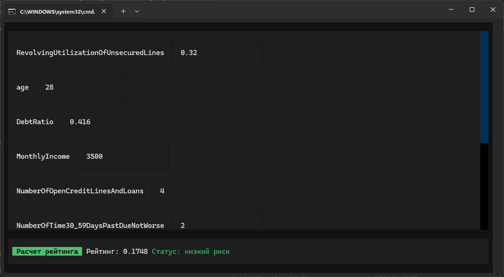

# Credit Risk



Проект для оценки кредитного риска по анкете клиента. Пользователь вводит основные финансовые и поведенческие признаки в терминальном интерфейсе, приложение отправляет их в API, а модель возвращает вероятность дефолта и интерпретирует ее как уровень риска.

> [!WARNING]
> Проект не предназначен для реального использования в кредитном скоринге. Это учебный и демонстрационный пример, а модель обучалась на уже устаревшем датасете `Give Me Some Credit` 2011 года.

## Что делает проект

- принимает набор признаков клиента;
- рассчитывает дополнительные производные признаки;
- передает данные в ансамбль обученных моделей;
- возвращает численный риск и статус риска в UI.

Основной сценарий использования: быстро проверить кредитный риск для одного клиента через локальный интерфейс.

## Как пользоваться

### Вариант 1. Запуск через Docker

Это основной и самый простой способ.

```bat
./run.bat
```

Для Linux/macOS:

```sh
./run.sh
```

Что происходит при запуске:

1. Поднимается `FastAPI`-сервис на порту `8080`.
2. Запускается терминальный UI на `Textual`.
3. Вы вводите значения признаков и нажимаете кнопку расчета.
4. UI отправляет запрос в API и показывает вероятность риска и его категорию.

### Вариант 2. Локальный запуск без Docker

API:

```bash
pip install -r requirements-api.txt
python -m src.api.api
```

UI:

```bash
pip install -r requirements-ui.txt
python -m src.ui.app
```

По умолчанию UI обращается к `http://localhost:8080`. При необходимости адрес API можно переопределить через переменную окружения `API_URL`.

## Как устроен проект

### Общая схема

- `src/api/api.py` содержит `FastAPI`-приложение, схему входных данных, расчет дополнительных признаков и вызов модели.
- `src/ui/app.py` содержит терминальный интерфейс на `Textual`, сбор пользовательского ввода и отправку запроса в API.
- `models/` хранит обученные модели и код пайплайнов/ансамблей.
- `docker/` содержит Dockerfile для API и UI.
- `data/` содержит подготовленные датасеты в нескольких вариантах.
- `*.ipynb` ноутбуки отражают этапы подготовки данных, обработки признаков и обучения моделей.

### Модель

В API используется сохраненный ансамбль из `models/Ensemble/ensemble.pkl`. Это ансамбль на классических ML-алгоритмах. Внутрь него входят:

- логистическая регрессия;
- `LightGBM`;
- `Gradient Boosting`.

Итоговый риск рассчитывается как агрегированная вероятность по предсказаниям этих моделей. Перед самим предсказанием по входным полям строятся дополнительные признаки, например:

- индикаторы пропусков;
- признаки высокой долговой нагрузки;
- агрегированная оценка просрочек;
- иные производные признаки.

Дальше эти признаки подаются в ансамбль, который объединяет предсказания базовых моделей и возвращает итоговую вероятность риска.

### Поток данных

1. Пользователь вводит признаки клиента в UI.
2. UI собирает `payload` и отправляет `POST`-запрос на `/credit_risk`.
3. API валидирует входные значения через `Pydantic`.
4. API рассчитывает дополнительные признаки и формирует `DataFrame`.
5. Модель возвращает `predict_proba`.
6. UI показывает рейтинг и текстовый статус риска.
## Пример API-запроса

```bash
curl -X POST http://localhost:8080/credit_risk \
  -H "Content-Type: application/json" \
  -d '{
    "RevolvingUtilizationOfUnsecuredLines": 0.32,
    "age": 28,
    "DebtRatio": 0.416,
    "MonthlyIncome": 3500,
    "NumberOfOpenCreditLinesAndLoans": 4,
    "NumberOfTime30_59DaysPastDueNotWorse": 2,
    "NumberOfTime60_89DaysPastDueNotWorse": 0,
    "NumberOfTimes90DaysLate": 0,
    "NumberRealEstateLoansOrLines": 2,
    "NumberOfDependents": 0
  }'
```

Ответ:

```json
{
  "credit_risk": 0.1748
}
```
